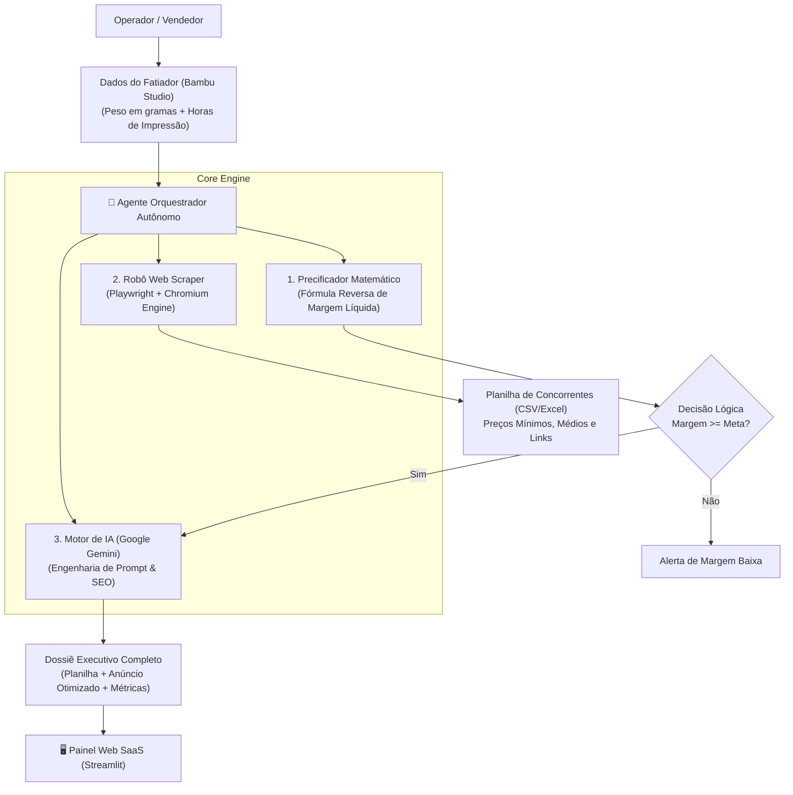

# ⚡ Bambu Studio Intelligence Suite Pro

> **Plataforma Autônoma de Inteligência Competitiva, Precificação Dinâmica e Geração de Catálogo com IA para E-commerce de Impressão 3D.**


---

## 🎯 Sobre o Projeto

O **Bambu Studio Intelligence Suite Pro** foi desenvolvido para resolver o principal gargalo de quem comercializa produtos de fabricação digital (impressoras 3D, com foco na **Bambu Lab A1**) nos maiores marketplaces do Brasil (**Mercado Livre e Shopee**):

1. **Margem de Lucro Oculta:** Evitar prejuízos calculando com exatidão filamento, energia (kWh), depreciação de bico/máquina, embalagem e as comissões complexas de cada marketplace.
2. **Inteligência Competitiva em Tempo Real:** Mineração automatizada de concorrentes no Mercado Livre via browser automation com Playwright (sem captchas ou bloqueios).
3. **Copywriting com IA:** Geração automatizada de títulos com SEO estrito (<60 caracteres), descrições persuasivas com gatilhos mentais e fichas técnicas formatadas utilizando a API do **Google Gemini**.
4. **Agente Autônomo & Dashboard Visual:** Interface SaaS moderna em **Streamlit** com design inspirado no ecossistema da Bambu Lab.

---

## 🏗️ Arquitetura do Sistema



---

## 📦 Módulos do Sistema

| Arquivo | Função / Responsabilidade |
| :--- | :--- |
| **`app.py`** | Dashboard Web completo em Streamlit com design Dark Slate & Bambu Emerald. |
| **`agente_gerente.py`** | Agente autônomo que orquestra custos, robô de concorrentes e toma decisões financeiras. |
| **`precificador.py`** | Motor financeiro com matemática reversa para Shopee e Mercado Livre. |
| **`pesquisador_mercado.py`** | Automação com Playwright para extração de preços e links de anúncios mais vendidos. |
| **`gerador_anuncios.py`** | Conexão com o Google Gemini para geração de anúncios prontos para publicação. |

---

## 🚀 Como Executar o Projeto

### 1. Clonar o repositório
```bash
git clone https://github.com/SEU_USUARIO/bambu-intelligence-suite.git
cd bambu-intelligence-suite
```

### 2. Instalar as dependências
```bash
pip install -r requirements.txt
playwright install chromium
```

### 3. Configurar a Chave da API do Google Gemini
Copie o arquivo `.env.example` para `.env`:
```bash
copy .env.example .env
```
Abra o arquivo `.env` e cole sua chave gratuita obtida no [Google AI Studio](https://aistudio.google.com/app/apikey):
```env
GEMINI_API_KEY=AIzaSy...
```

### 4. Iniciar a Aplicação
```bash
python -m streamlit run app.py
```
O navegador abrirá automaticamente em `http://localhost:8501`.

---

## 🧠 Metodologia de Desenvolvimento

Este projeto foi construído utilizando **Engenharia de Software Assistida por Inteligência Artificial (AI Pair Programming & Agentic Workflows)**.

* **Papel:** Arquiteto de Soluções, Product Owner e Validação Operacional.
* **Metodologia:** Desenvolvimento orientado a casos reais de negócio, garantindo código limpo, modular, documentado e à prova de obsolescência técnica.

---

## 📄 Licença

Distribuído sob a licença MIT. Veja `LICENSE` para mais informações.
